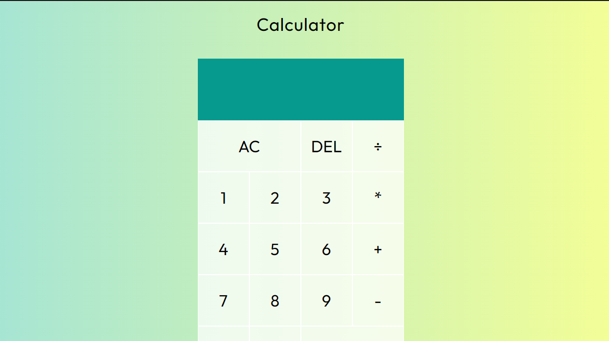

# Calculator
I made a calculator using HTML CSS and JAVASCRIPT

### Screenshot

### Links

- Solution URL: [https://github.com/Teke111/Calculator]
- Live Site URL: [https://teke111.github.io/Calculator/]

### Built with

- Semantic HTML5 markup
- CSS custom properties

